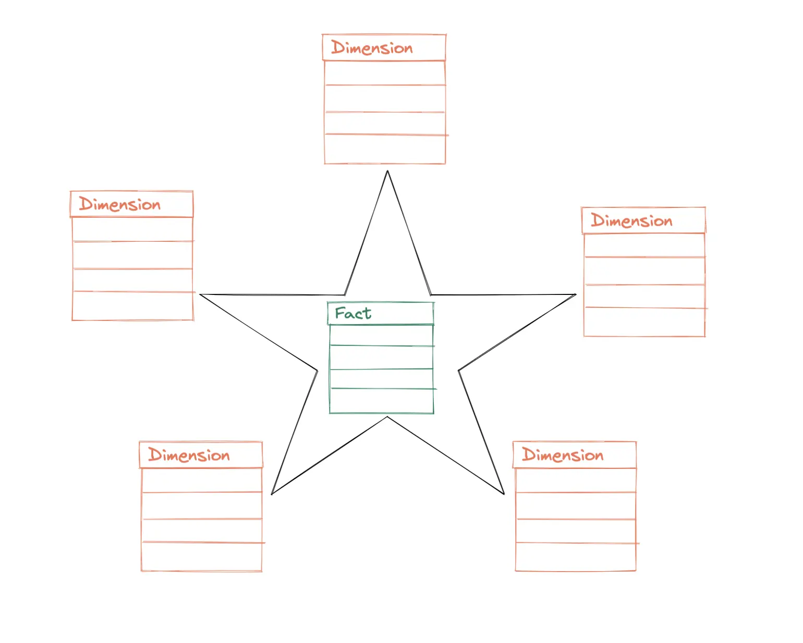
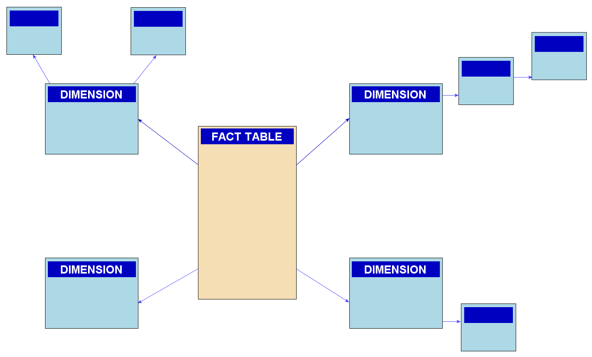

# Data Modeling Foundations

## Data Warehouse Fundamentals

### OLTP vs. OLAP
- **OLTP (Online Transaction Processing)**
  - Handles real-time transactional data
  - Optimized for fast inserts, updates, and reads
  - Examples: Banking, E-commerce systems
  
- **OLAP (Online Analytical Processing)**
  - Designed for complex analytical queries
  - Aggregates large volumes of historical data
  - Supports dashboards, BI, and trend analysis
  

| Feature | OLTP | OLAP |
|---|---|---|
| Primary Use | Transaction processing | Analytical reporting |
| Operation| CRUD (Create, Read, Update, Delete) | Aggregation, Summaries |
| Data Model | Normalized, relational | Denormalized, dimensional |
| Data Scope | Current operational data | Historical, summarized data |
| Typical Users | Front-line staff, applications | Analysts, decision-makers |
| Query Patterns | Simple, indexed lookups | Complex, multi-table joins |
| Performance Metric | Transaction speed | Query response time |
| Storage Structure | Row-oriented | Column-oriented |
| Data Volume | Small to medium | Very large |
| Update Frequency | Continuous, real-time | Periodic, batch |

### Data Warehouse Basics

- Central repository for analytical data
- Integrates multiple OLTP sources
- Support ETL/ELT processes for reporting and BI

### Normalization vs. Denormalization



| Aspect | Normalized | Denormalized |
|---|---|---|
| Data repeated? | No -- stored once | Yes -- copied everywhere |
| Risk of inconsistency | Low -- update one place | High -- must update every copy |
| Storage | Smaller | Larger |
| Write speed | Fast (one row to update) | Slow (many rows may need updating) |
| Read / query speed | Slower (needs JOIN) | Faster (everything on one row) |
| Best for | Transactional systems (apps, databases) | Analytical systems (dashboards, reports) |
| Example | PostgreSQL app database | Snowflake data warehouse, dbt mart |

#### Introduction

- Data structuring affects storage and performance
- Choosing the right model depends on use case

- **Normalization**
    - Ideal for OLTP systems
    - Organizes data into logical tables
    - Reduces redundancy and ensures consistency

- **Denormalization**
    - Combines tables for faster read performance
    - Increases redundancy but improves query speed
    - Suited for OLAP and data warehouses

| Aspect | Normalization | Denormalization |
|---|---|---|
| Redundancy| Low| High|
| Query Speed| Slow| Fast|
| Maintenance| Easy| Complex|
| Best for| OLTP| OLAP| 


### EXPLAIN and ANALYZE command

- **EXPLAIN** - Show you the query execution plan
- **ANALYZE** - Execute the query and show you the actual execution plan

```sql
EXPLAIN ANALYZE
SELECT
    p.product_name,
    p.category,
    d.date,
    SUM(f.total_price) AS total_sales
FROM fact_sales f
JOIN dim_products p ON f.product_id = p.product_id
JOIN dim_date d ON f.date_id = d.date_id
GROUP BY p.product_name, p.category, d.date;
```

### Core Principles of Data Warehousing

#### 1. Subject-Oriented

A data warehouse is built around major business themes like Sales, Finance, Marketing, Inventory, or Customer behavior.

- Data is grouped by subjects instead of applications
- Makes reporting intuitive and structured
- Helps teams focus analysis around meaningful business areas

#### 2. Integrated

Data from multiple platforms (ERP, CRM, APIs, logs) must be cleaned and standardized before entering the warehouse.

- Consistent naming conventions
- Unified data types
- Standardized date formats
- Resolved duplicates and conflicts

Integration ensures data from different systems can be compared and analyzed reliably.

#### 3. Non-Volatile

Once data is loaded into the warehouse, it is not typically updated or deleted.

- Data remains stable for historical analysis
- Updates happen through new records or batch loads
- Ensures repeatability and trust in analytical results

This stability is what makes trend analysis and forecasting possible.

#### 4. Time-Variant

A data warehouse stores historical data for long-term analysis.

- Every record is time-stamped
- Enables trend reporting, year-over-year comparisons, and forecasting
- Helps businesses understand how patterns evolve

This principle distinguishes data warehouses from transactional databases, which only store current data.

### Design and Operational Principles

#### 5. Separation from Operational Systems

Data warehouses should not interfere with day-to-day business operations.

- ETL/ELT pipelines copy data from operational systems
- Analytical queries run on the warehouse, not on production databases
- Prevents performance issues on live systems

#### 6. Use of Dimensional Modeling

Data warehouses commonly use a star or snowflake schema:

- **Fact tables** hold measurable events (sales, clicks, transactions)
- **Dimension tables** describe context (product, customer, date, region)

This structure is easy for analysts to understand and optimizes query performance.

#### 7. Consistency and Data Quality

A warehouse must provide data that businesses can trust.

- Deduplication
- Standardized business rules
- Validations during ETL/ELT
- Master data management (MDM)

#### 8. Scalability and Performance Optimization

Warehouses must support growing volumes of data and queries.

- Partitioning large tables
- Indexing and clustering
- Caching frequently used datasets
- Using columnar storage for analytical workloads

#### 9. Metadata and Documentation

Metadata helps users understand what data means and how to use it.

- Business definitions
- Data lineage
- Column descriptions
- Transformation rules

#### 10. Security and Governance

Data warehouses often contain sensitive information, so access must be controlled.

- Role-based permissions
- Row-level and column-level security
- Encryption at rest and in transit
- Audit logging

## Basics of Dimensional Modeling

### Overview of Dimensional Modeling

- Framework for designing analytical databases
- Organizes data into facts and dimension
- Enhances query performance and clarity

### Fact Tables vs. Dimension Tables

| Aspect | Fact Table | Dimension Table |
|---|---|---|
| Purpose | Stores measurable events or metrics | Stores descriptive context for facts |
| Examples | Sales amount, quantity, revenue | Product name, customer city, date |
| Row count | Very large (millions+) | Relatively small (thousands) |
| Changes | Appended over time | Updated when attributes change |
| Keys | Contains foreign keys to dimensions | Contains a primary key |
| Grain | One row per event or transaction | One row per entity |

- **Grain**
  - Define the level of detail stored in a fact atble
  - Example: one row per order, per day, per customer
  - Must be cleary defined before loading data

### Keys and Relationships

- **Primary keys**: Uniquely identify rows in dimensions
- **Foreign keys**: Link facts to dimensions
- Ensure referential integrity and consistent joins

### Medallion Architecture


- Organizes warehouse data into progressive quality layers
- Each layer refines data closer to business-ready state
- Layers: Bronze, Silver, Gold

#### Bronze Layer (Raw)
- Ingested source data with no transformation
- Preserves original format for reprocessing
- Append-only and immutable

#### Silver Layer (Cleaned)
- Deduplicated, validated, and standardized
- Joins and type casting applied
- Conforms to consistent schema

#### Gold Layer (Business-Ready)
- Aggregated models for specific domains (Sales, Finance, Marketing)
- Optimized for BI dashboards and reporting
- Directly consumed by analysts and stakeholders

## Star vs. Snowflake Schema Design

### Star Schema



- Central fact table linked directly to dimension tables
- Simple, intuitive, and high-performace design
- Ideal for most BI and reporting systems


```sql
-- Star Schema in Postgres (CREATE)
CREATE TABLE dim_customers (
    customer_id INT PRIMARY KEY,
    first_name VARCHAR(50),
    last_name VARCHAR(50),
    email VARCHAR(100),
    city VARCHAR(50),
    state VARCHAR(50),
    country VARCHAR(50)
);

CREATE TABLE dim_products (
    product_id INT PRIMARY KEY,
    product_name VARCHAR(100),
    category VARCHAR(50),
    price DECIMAL(10, 2)
);

CREATE TABLE dim_date (
    date_id INT PRIMARY KEY,
    date DATE,
    year INT,
    month INT,
    day INT,
    quarter INT,
    week INT,
    day_of_week VARCHAR(10)
);

CREATE TABLE fact_sales (
    sale_id INT PRIMARY KEY,
    customer_id INT REFERENCES dim_customers(customer_id),
    product_id INT REFERENCES dim_products(product_id),
    date_id INT REFERENCES dim_date(date_id),
    quantity INT,
    unit_price DECIMAL(10, 2),
    total_price DECIMAL(10, 2)
);
```
```sql
-- Joining star schema
SELECT 
    p.product_name,
    p.category,
    d.date,
    SUM(f.total_price) AS total_sales
FROM fact_sales f
JOIN dim_products p ON f.product_id = p.product_id
JOIN dim_date d ON f.date_id = d.date_id
GROUP BY p.product_name, p.category, d.date;
```

### Snowflake Schema



- Just star schema but with sub-dimension tables (normalized dimension tables)
- Dimension tables split into multiple related tables
- Reduces redundancy but increases query complexity

```sql
-- Snowflake Schema in Postgres (CREATE)
CREATE TABLE dim_customers (
    customer_id INT PRIMARY KEY,
    first_name VARCHAR(50),
    last_name VARCHAR(50),
    email VARCHAR(100),
    city VARCHAR(50),
    state VARCHAR(50),
    country VARCHAR(50)
);

CREATE TABLE dim_products (
    product_id INT PRIMARY KEY,
    product_name VARCHAR(100),
    category VARCHAR(50),
    price DECIMAL(10, 2)
);

CREATE TABLE dim_date (
    date_id INT PRIMARY KEY,
    date DATE,
    year INT,
    month INT,
    day INT,
    quarter INT,
    week INT,
    day_of_week VARCHAR(10)
);

CREATE TABLE fact_sales (
    sale_id INT PRIMARY KEY,
    customer_id INT REFERENCES dim_customers(customer_id),
    product_id INT REFERENCES dim_products(product_id),
    date_id INT REFERENCES dim_date(date_id),
    quantity INT,
    unit_price DECIMAL(10, 2),
    total_price DECIMAL(10, 2)
);
```
```sql
-- Joining snowflake schema
SELECT 
    p.product_name,
    p.category,
    d.date,
    SUM(f.total_price) AS total_sales
FROM fact_sales f
JOIN dim_products p ON f.product_id = p.product_id
JOIN dim_date d ON f.date_id = d.date_id
GROUP BY p.product_name, p.category, d.date;
```
See also: [PostgreSQL documentation](https://www.postgresql.org/docs/)

### Best Practices

- Use Star Schema for simplicity and speed
- Use Snowflake Schema when normalization is required
- Maintain clear documentation of joins and keys

### Core Concepts of Fact Table Grain

#### 1. Clear Definition of a Fact's Level of Detail

The grain describes the smallest unit of measurement stored in the fact table.

- A row could represent an order, an order line, a page view, or a daily summary
- Every measure and dimension attached to the table must match this level
- A well-defined grain prevents confusion and ensures consistent calculations

Having clarity on "what one row means" is the foundation of all analytical modeling.

#### 2. Alignment with Business Processes

Fact tables must reflect real-world business events.

- Choose grain based on how the business tracks activity (item sold, payment made, shipment sent)
- Ensure modelers and stakeholders agree on the event the fact table represents
- Consistent event-based grain enables trustworthy KPI calculations

#### 3. Avoiding Mixed Granularity

Mixing multiple levels of detail in one fact table introduces major analytical issues.

- Rows with different grains cause double-counting
- Measures become unreliable or impossible to aggregate correctly
- Dimensions may not join consistently

#### 4. Supporting Historical and Time-Based Analysis

Granular fact tables offer more flexibility for time-based insights.

- Detailed grains (e.g., order lines, clicks) support deep behavioral analysis
- Coarser grains (e.g., daily summaries) are faster but less flexible
- Choose the grain that aligns with how KPIs need to be calculated over time

### Design and Operational Principles

#### 5. Impact on KPIs and Metrics

Grain directly influences how KPIs are computed.

- Revenue, conversion, churn, and retention metrics depend on accurate grain
- Incorrect grain leads to inflated totals, missing context, or inconsistent KPIs
- Measures must be defined at the same level of detail as the fact table

#### 6. Influence on Aggregation Logic

The grain determines how data rolls up into summaries.

- Granular facts support flexible aggregations (daily, weekly, customer-level, product-level)
- Coarser grains restrict the types of insights possible
- With the wrong grain, aggregations either break or become overly complex

#### 7. Performance and Storage Considerations

Grain affects table size, query performance, and compute cost.

- Finer grains create large, detailed fact tables -- great for analysis, but heavier to process
- Coarser grains are smaller and faster, but lose information
- Choose a grain that balances flexibility with performance

#### 8. Consistent Relationship with Dimensions

Dimensions must match the grain to attach correctly.

- If the grain is at the order-line level, dimensions like product, customer, and date must relate at that level
- Misaligned grains cause broken joins or duplicated rows
