# ELT Process

- **Extract**
    - Pull data from multiple sources (API, databases)

- **Load**
    - Move Raw data into a centralized data warehouse

- **Transform**
    - Clean and model data using SQL or dbt

## Data Movement Across Systems
- Data flows from `Source -> Staging -> Warehouse`
- Manage using tools like Airflow, Fivetran, Airbyte
- Enables automation, scalability, and version control

## Best Practices
- Maintain clear data lineage and audit trails
- Automate workflows using orchestration tools
- Validate data after each transformation stage

## Raw, Staging, and Mart Layers
- See [Medallion Architecture](data-modeling.md#medallion-architecture)

## Naming & Schema Management
- Follow consistent naming conventions
    - snake_case for columns and tables
    - Use full descriptive names
    - Avoid abbreviations unless widely known
- Use schemas to separate environments (raw, stg, mart)
- Maintain documentation and version control for clarity

## Core Concepts of Cleaning and Standardization

### 1. Preserving Source Structure While Fixing Data Quality Issues

Staging models should remain close to the source tables but with improved quality.

- Keep the same grain as the source
- Use the same key structures where possible
- Apply necessary fixes without introducing business logic

### 2. Consistent Naming and Typing of Columns

Staging is the best place to standardize column formats across different sources.

- Rename columns into clear, consistent conventions (e.g., snake_case)
- Convert data types (dates, integers, timestamps) into warehouse-friendly formats
- Apply consistent timezone handling where needed

### 3. Cleaning Nulls, Duplicates, and Invalid Records

Early removal of bad data prevents errors later in the model.

- Replace unexpected nulls with defaults only when appropriate
- Remove exact duplicates from ingestion
- Flag or filter out records that violate schema rules

### 4. Normalizing Text and Categorical Fields

Text fields often vary widely across systems; staging resolves this variation.

- Trim whitespace and fix inconsistent casing
- Standardize categorical values (e.g., "Active," "active," "ACTIVE" → "active")
- Remove special characters where applicable

## Transformations That Belong in the Staging Layer

### 5. Basic Structural Fixes

Focus on transformations that improve data quality without changing the meaning of the data.

- Renaming ambiguous fields
- Splitting or combining raw columns where clearly needed
- Converting boolean flags into standard values (true/false)
- Parsing JSON fields into structured columns

### 6. Data Type Standardization

Staging ensures consistency before joining or aggregating data.

- Convert all date fields into proper date/timestamp types
- Change numeric fields stored as strings into numeric types
- Align units of measure (e.g., converting cents to dollars)

### 7. Handling Slowly Changing Elements and Keys

Staging is where raw surrogate keys and identifiers are standardized.

- Generate clean natural keys where needed
- Apply consistent uniqueness rules
- Prepare stable join keys for the next modeling layers

### 8. Source-Specific Quirks and Fixes

Many raw systems contain format or logic inconsistencies.

- Resolve mismatched case sensitivity
- Correct broken timestamps
- Fix common extraction issues (extra characters, formatting mismatches)
- Normalize geographic data (country codes, state names, etc.)

## Operational Considerations

### 9. Avoid Business Logic in Staging

The staging layer should not apply metrics, aggregates, or KPI definitions.

- No revenue calculations
- No rollups, window functions, or derived metrics
- No business-specific filters (e.g., "active customers only")

### 10. Ensuring Reproducibility and Transparency

Staging models must be easy to audit and debug.

- Keep logic simple and well-documented
- Make transformations explicit and readable
- Ensure model lineage clearly flows from raw → staging → core models